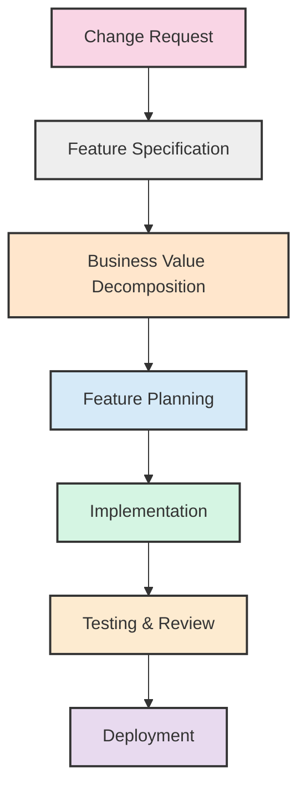

> [!info] Draft Document
> This document is an initial draft and may change significantly.

# Development Workflow

This document outlines our end-to-end development workflow from change request to feature implementation. It provides a clear process for all team members to follow, ensuring consistent and high-quality delivery.

## Workflow Overview

Our development workflow consists of the following key phases:

1. **Change Request**: Formal documentation of a proposed change
2. **Feature Specification**: Detailed description of the feature to be implemented
3. **Business Value Decomposition**: Analysis to prioritize feature components by business value
4. **Feature Planning**: Technical planning for implementation
5. **Implementation**: Development of the feature
6. **Testing & Review**: Verification that the feature meets requirements
7. **Deployment**: Release of the feature to production

## Detailed Process

### 1. Change Request Phase

**Objective**: Formally document and approve a proposed change.

**Key Template**: [Change Request Template](Templates/change_request_template.md)

**Steps**:

1. **Initiate Change Request**:
   - Stakeholder identifies need for change
   - Product Owner/Business Analyst creates Change Request document using template
   - Document is assigned a unique CR number (CR-XXXX)

2. **Evaluate Change Request**:
   - Technical team performs initial assessment
   - Business impact is evaluated
   - Resource requirements are estimated

3. **Approve Change Request**:
   - Change Control Board reviews Change Request
   - Decision made to approve, reject, defer, or request modifications
   - Approved Change Requests proceed to Feature Specification phase

**Responsible Roles**:
- Request Initiator
- Product Owner
- Technical Lead
- Change Control Board

**Outputs**:
- Completed Change Request document with approval status

### 2. Feature Specification Phase

**Objective**: Create a detailed specification of the feature based on the approved Change Request.

**Key Template**: [Feature Specification Template](Templates/feature_specification_template.md)

**Steps**:

1. **Develop Feature Specification**:
   - Business Analyst/Product Owner creates Feature Specification document
   - User stories and acceptance criteria are defined
   - Technical considerations are documented
   - UI/UX requirements are specified

2. **Create Gherkin Feature File**:
   - QA/Business Analyst creates Gherkin feature file using template
   - All scenarios and acceptance criteria are documented in BDD format
   - File is stored in features directory

3. **Review Specification**:
   - Stakeholders review Feature Specification
   - Technical team reviews for implementation feasibility
   - QA reviews for testability
   - Feedback incorporated and specification updated

4. **Approve Specification**:
   - Product Owner approves Feature Specification
   - Technical Lead approves technical aspects

**Key Template**: [Gherkin Feature Template](Templates/gherkin_feature_template.md)

**Responsible Roles**:
- Business Analyst
- Product Owner
- Technical Lead
- QA Engineer

**Outputs**:
- Completed Feature Specification document with approval
- Gherkin feature file with scenarios

### 3. Business Value Decomposition Phase

**Objective**: Analyze and prioritize feature components based on business value to enable incremental value delivery.

**Key Template**: [Business Value Decomposition Template](Templates/business_value_decomposition_template.md)

**Steps**:

1. **Identify Value Drivers**:
   - Product Owner and stakeholders identify key business value drivers
   - Each value driver is rated for impact and assigned to relevant stakeholders
   - Clear metrics for measuring value are established

2. **Decompose Feature into Components**:
   - Technical and business teams collaborate to break down the feature into components
   - Each component is mapped to value drivers it satisfies
   - Implementation complexity is estimated for each component
   - Value-to-complexity ratio is calculated

3. **Define Value Delivery Sequence**:
   - Define the Minimum Viable Solution (MVS) that delivers meaningful value
   - Identify value increments beyond the MVS
   - Map technical dependencies between components
   - Create phased implementation approach based on value and dependencies

4. **Review and Approve Decomposition**:
   - Stakeholders review the value delivery sequence
   - Technical team validates the implementation approach
   - Product Owner approves the business value decomposition

**Responsible Roles**:
- Product Owner
- Business Stakeholders
- Technical Lead
- Software Architect
- Business Analyst

**Outputs**:
- Completed Business Value Decomposition document
- Phased implementation approach with clear value milestones
- Decision points for evaluating progress and potential pivots

### 4. Feature Planning Phase

**Objective**: Plan the technical implementation details based on the Feature Specification and Business Value Decomposition.

**Key Template**: [Feature Implementation Plan Template](Templates/feature_planning_template.md)

**Steps**:

1. **Create Implementation Plan**:
   - Technical Lead/Software Architect creates Feature Implementation Plan
   - Domain concepts are identified
   - Implementation steps are outlined according to the value delivery sequence
   - Dependencies are documented
   - Testing strategy is defined

2. **Review Implementation Plan**:
   - Development team reviews the plan
   - Implementation approach is validated
   - Risks are identified and mitigation strategies are defined
   - Estimates are validated

3. **Prepare for Implementation**:
   - Development environment is set up
   - Required dependencies are ensured
   - Implementation tasks are created in project management tool

**Responsible Roles**:
- Technical Lead
- Software Architect
- Senior Developers

**Outputs**:
- Completed Feature Implementation Plan document
- Tasks in project management tool

### 5. Implementation Phase

**Objective**: Develop the feature according to the Implementation Plan, following the value delivery sequence and component architecture.

**Key Templates**:
- [Handoff Protocol Template](Templates/handoff_protocol_template.md)
- [Progress Tracking Template](Templates/progress_tracking_template.md)
- [Implementation Workflow Guide](implementation_workflow_guide.md)
- Component Development Guides (various guides for each component type)

**Steps**:

1. **Prepare for Development**:
   - Complete the Handoff Protocol checklist
   - Set up Progress Tracking document
   - Create development branch
   - Configure development environment

2. **Implement Foundation Components**:
   - Develop components required for technical reasons first
   - Follow appropriate component guide for each component type
   - Test each component thoroughly
   - Update Progress Tracking document after each component

3. **Implement in Value-Driven Increments**:
   - **Minimum Viable Solution (MVS)**:
     - Develop components required for the MVS
     - Follow component-specific development guides
     - Update Progress Tracking document for each component
     - Validate MVS with stakeholders before proceeding

   - **Value Increment 1**:
     - Develop components for the first value increment
     - Follow layer-by-layer implementation approach:
       1. Domain Layer components first
       2. Application Layer components next
       3. Infrastructure Layer components
       4. UI/Presentation Layer components last
     - Update Progress Tracking document for each component
     - Validate increment with stakeholders

   - **Subsequent Value Increments**:
     - Implement remaining value increments in priority order
     - Follow component-specific development guides
     - Update Progress Tracking after each component
     - Validate each increment with stakeholders

4. **Integration and Review**:
   - Ensure all components work together properly
   - Conduct thorough integration testing
   - Update documentation as needed
   - Prepare for Code Review

5. **Code Review**:
   - Submit code for review
   - Address review feedback
   - Ensure architectural compliance
   - Update documentation as needed

**Responsible Roles**:
- Developers
- Technical Lead
- Code Reviewers
- Product Owner (for increment validation)

**Outputs**:
- Implemented feature in code
- Completed test suite
- Updated Progress Tracking document
- Value increments ready for testing

**Component-Driven Development Approach**:

For each component to be implemented:

1. **Component Planning**:
   - Identify the component's architectural category (Entity, Value Object, Repository, etc.)
   - Review relevant component guide for that category
   - Define test cases based on acceptance criteria

2. **Component Development**:
   - Start with interfaces before implementations
   - Write tests before implementation code
   - Follow the specific guide for the component's architectural category
   - Focus on the component's single responsibility

3. **Component Testing**:
   - Test the component thoroughly
   - Verify behavior in isolation and in context
   - Test error handling and edge cases

4. **Progress Update**:
   - Update Progress Tracking document
   - Document any deviations or issues

This component-driven approach ensures each part of the feature is developed according to architectural standards while focusing on incremental business value delivery.

### 6. Testing & Review Phase

**Objective**: Verify that the implemented feature meets all requirements.

**Steps**:

1. **Run Test Suite**:
   - Execute unit tests
   - Execute integration tests
   - Execute E2E tests based on Gherkin scenarios

2. **QA Testing**:
   - QA executes tests according to test plan
   - Bugs are documented
   - Regression testing is performed

3. **Feature Review**:
   - Product Owner reviews implemented feature
   - Stakeholders validate that business requirements are met
   - Validate that expected business value is achievable
   - Final approval is given

**Responsible Roles**:
- QA Engineers
- Developers
- Product Owner
- Stakeholders

**Outputs**:
- Test results
- Bug reports (if any)
- Final approval
- Business value validation

### 7. Deployment Phase

**Objective**: Release the feature to production environment, following the value increment approach.

**Steps**:

1. **Prepare for Deployment**:
   - Create deployment plan aligned with value increments
   - Configure feature flags to enable/disable specific components
   - Update documentation

2. **Deploy to Staging**:
   - Deploy feature to staging environment
   - Perform final verification

3. **Deploy to Production**:
   - Deploy MVS to production first when possible
   - Monitor for issues and measure business value
   - Deploy subsequent value increments based on decision points
   - Activate feature flags for each increment

4. **Post-Deployment Activities**:
   - Update documentation
   - Measure actual business value delivered
   - Conduct knowledge sharing sessions if needed
   - Complete retrospective

**Responsible Roles**:
- DevOps Engineers
- Release Managers
- Developers
- Technical Lead
- Product Owner (for value measurement)

**Outputs**:
- Deployed feature increments
- Business value metrics
- Updated documentation
- Retrospective notes

## Working with AI Agents

When working with AI agents in the development workflow, special considerations should be applied:

### 1. Clear Instructions

- Provide explicit instructions in task descriptions
- Use templates consistently for all requests to AI agents
- Include all necessary context in the request

### 2. Validation Points

- Always review AI-generated code before incorporation
- Validate outputs against acceptance criteria
- Use the Content Maturity Framework to indicate the status of AI-generated content

### 3. Efficiency Techniques

- Break complex tasks into smaller, well-defined tasks
- Provide examples for similar tasks when available
- Include relevant code patterns and standards in the request

### 4. Integration with Documentation

- Ensure AI agents have access to relevant documentation
- Use feature specifications as input for AI-generated code
- Document any deviations or decisions made during AI-assisted development

### 5. Value-Driven Development with AI

- Provide AI agents with the Business Value Decomposition document
- Clearly indicate which value increment is being implemented
- Ask AI to focus on core value-delivering components first
- Have AI explain how its implementation aligns with business value priorities

### 6. Component-Driven Development with AI

- Provide AI agents with the specific component guide for the type being implemented
- Ask AI to focus on one component at a time
- Have AI explain how it's following the architectural guidelines
- Review AI-generated code for architectural compliance
- Use component-specific prompt templates for consistent results

## Content Maturity Levels

As specified in our [Content Maturity Framework](Content%20Maturity%20Framework.md), all documentation follows these maturity levels:

1. 🤖 **AI-Generated**: Initial raw content from AI
2. 📝 **Draft**: Human-reviewed but still work in progress
3. 🔍 **In-Review**: Complete enough for peer review
4. ✅ **Tested**: Successfully applied in at least one project
5. 🌟 **Stable**: Validated across multiple projects

All workflow documents should include the appropriate status callout and be updated as they mature.

## Workflow Enforcement

To ensure adherence to this workflow:

1. **Automation Checks**:
   - Pull requests require documentation according to templates
   - CI/CD pipeline verifies presence of required documents
   - Status checks ensure documents are at appropriate maturity level

2. **Review Gates**:
   - Change Request approval required before Feature Specification
   - Feature Specification approval required before Business Value Decomposition
   - Business Value Decomposition approval required before Implementation Planning
   - Implementation Plan approval required before development starts

3. **Documentation Requirements**:
   - All code changes must trace back to an approved Change Request
   - All feature implementations must have associated documentation
   - All deployed features must have updated and accurate documentation

4. **Component Compliance Checks**:
   - Pull requests include component category tags
   - Code reviews verify compliance with component-specific guidelines
   - Automated tests check for architectural boundary violations
   - Documentation must reference appropriate component guides

## Templates

The following templates support this workflow:

1. [Change Request Template](Templates/change_request_template.md)
2. [Feature Specification Template](Templates/feature_specification_template.md)
3. [Business Value Decomposition Template](Templates/business_value_decomposition_template.md)
4. [Gherkin Feature Template](Templates/gherkin_feature_template.md)
5. [Feature Implementation Plan Template](Templates/feature_planning_template.md)
6. [Handoff Protocol Template](Templates/handoff_protocol_template.md)
7. [Progress Tracking Template](Templates/progress_tracking_template.md)
8. [Implementation Workflow Guide](implementation_workflow_guide.md)
9. Component Development Guides (various guides in the Guides directory)

## Document History

| Version | Date | Changes | Author |
|---------|------|---------|--------|
| 0.1 | 2025-04-16 | Initial draft | Claude |
| 0.2 | 2025-04-17 | Added Business Value Decomposition phase | Claude |
| 0.3 | 2025-04-18 | Enhanced Implementation Phase with component-driven approach | Claude |